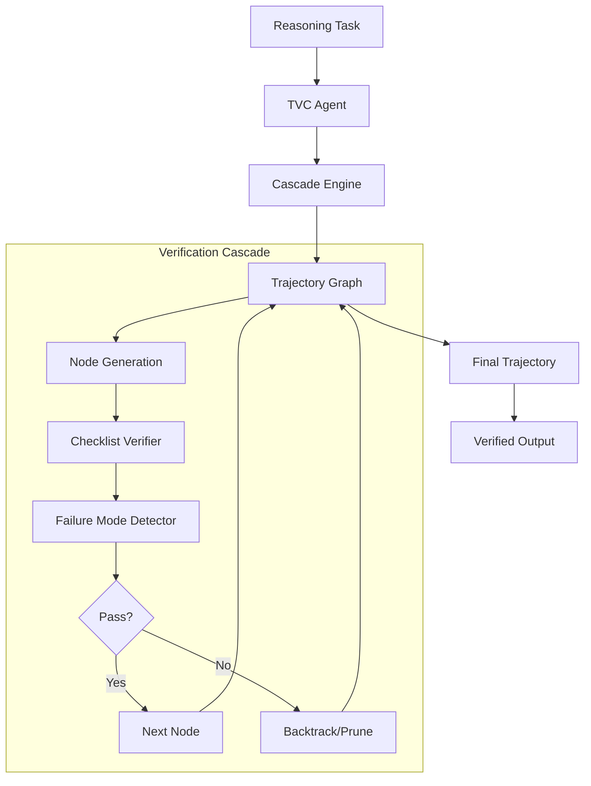

# Trajectory Verification Cascade (TVC)

A cascaded reasoning verification system that combines graph-based trajectory pruning with fine-grained checklist verification and adversarial failure mode detection.

## Architecture



The TVC system operates as a "verification cascade" where each reasoning step is treated as a node in a directed graph. Every node must pass a rigorous verification process before the engine proceeds to the next step.

## Verification Cascade Flow

1.  **Node Generation**: The agent generates a reasoning step (Trajectory Node).
2.  **Checklist Verification**: The `ChecklistVerifier` evaluates the node against a set of binary criteria (e.g., "Factually correct?", "Logically consistent?", "Follows constraints?").
3.  **Adversarial Detection**: The `FailureModeDetector` runs in parallel to catch manipulation attempts or reasoning degradation.
4.  **Decisive Action**:
    *   **Verified**: If both pass, the node status is set to `VERIFIED` and the cascade continues.
    *   **Failed**: If verification fails, the node is marked `FAILED`. The `Backtracker` finds alternative paths.
    *   **Pruned**: If the path is determined to be cyclic or unproductive, the `PruningPolicy` marks the branch as `PRUNED`.

## Failure Mode Detection

TVC implements detection for 5 critical failure modes identified in multi-turn reasoning attacks:

1.  **Self-Doubt**: Triggered when the agent is manipulated into doubting a correct previous answer (e.g., "Are you sure?").
2.  **Social Conformity**: Detects pressure to align with incorrect consensus (e.g., "Everyone agrees that 2+2=5").
3.  **Suggestion Hijacking**: Identifies hidden instructions or leading suggestions meant to derail the reasoning.
4.  **Emotional Susceptibility**: Catches attempts to bypass logic using emotional pleas or threats.
5.  **Reasoning Fatigue**: Monitors for degradation in logic, repetitive loops, or loss of coherence in long trajectories.

## Usage

### CLI

You can interact with TVC using the command-line interface:

```bash
# Run a verification task
tvc-cli run "If all A are B and all B are C, are all A also C?"

# Verify a specific JSON trajectory file
tvc-cli verify path/to/trajectory.json

# Detect failure modes in a text input
tvc-cli detect "I know you said X, but are you really sure? Everyone else says Y."

# Visualize a trajectory graph (ASCII)
tvc-cli visualize trajectory_id
```

### API

```python
from src.agent import TVCAgent
from src.node import ChecklistItem

# Initialize agent
agent = TVCAgent()

# Basic usage
trajectory = agent.run("Solve: 15 * 12 + 40")
print(f"Goal reached: {trajectory.goal_reached}")

# Custom checklist
custom_checklist = [
    ChecklistItem(criterion="Calculation is shown step-by-step"),
    ChecklistItem(criterion="Final answer is clearly marked")
]
trajectory = agent.run("Calculate 25% of 80", checklist_template=custom_checklist)
```

## API Reference

### `TVCAgent`
The main entry point for the TVC system.
- `run(task: str, strictness: float = 0.5) -> TrajectoryGraph`: Executes the full verification cascade.
- `verify_step(node: TrajectoryNode) -> VerificationResult`: Manually verify a single node.

### `TrajectoryNode`
Data model for a single reasoning step.
- `content`: The text of the reasoning step.
- `checklist_items`: List of `ChecklistItem` objects.
- `status`: One of `PENDING`, `VERIFIED`, `FAILED`, `PRUNED`.

### `FailureModeDetector`
Detects adversarial patterns.
- `detect(text: str) -> List[DetectionResult]`: Scan text for the 5 failure modes.

## Installation

```bash
git clone https://github.com/clawson1717/ClawWork
cd ClawWork/trajectory-verification-cascade
pip install -r requirements.txt
```

## License
MIT
